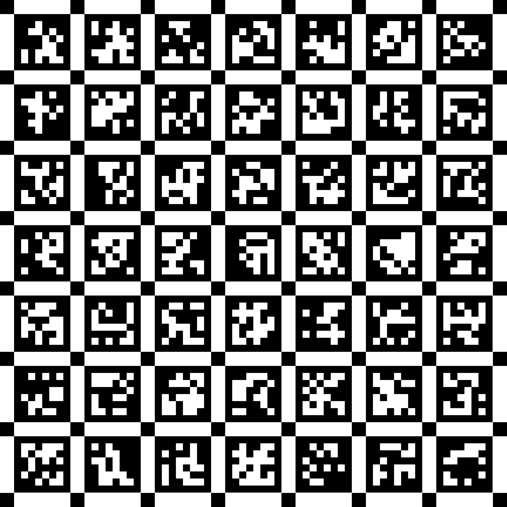

# AprilTag Board Generator

A Python utility for generating high-resolution AprilTag calibration boards for multi-camera calibration systems.

## Features

- **Multiple AprilTag Families**: Support for 36h11, 25h9, and 16h5 families
- **YAML Configuration**: Flexible configuration through YAML files
- **High-Resolution Output**: PNG and PDF formats optimized for printing
- **Customizable Layouts**: Configurable grid sizes, tag dimensions, and spacing
- **Calibration Ready**: Automatic generation of calibration parameters
- **Print Verification**: Corner markers and alignment features

## Sample Output



*Example of generated 7x7 AprilTag board (IDs 0-48) with 40mm tags and 10mm spacing*

## Installation

Install required dependencies:

```bash
pip install numpy opencv-python pyyaml matplotlib
```

## Quick Start

### 1. Generate with Default Settings

```bash
python3 generate_apriltag_boards.py
```

This generates 3 boards (7x7 grid, 40mm tags, 10mm spacing) using the default `config.yaml`.

### 2. Custom Configuration

Create your own configuration file:

```yaml
apriltag:
  family: "36h11"     # Options: "36h11", "25h9", "16h5"
  grid_x: 6           # Number of tags horizontally
  grid_y: 4           # Number of tags vertically
  tag_size_mm: 30     # Tag size in millimeters
  spacing_mm: 8       # Spacing between tags
  border_mm: 15       # Border around board
  dpi: 600            # Print resolution

boards:
  - name: "Custom Board 1"
    start_id: 0
    end_id: 23
  - name: "Custom Board 2"
    start_id: 24
    end_id: 47

output:
  directory: "my_boards"
```

Then generate:

```bash
python3 generate_apriltag_boards.py --config my_config.yaml
```

### 3. Command Line Overrides

Override specific parameters:

```bash
python3 generate_apriltag_boards.py --dpi 600 --tag-size 50 --output custom_output
```

## AprilTag Families

| Family | Unique Tags | Robustness | Use Case |
|--------|-------------|------------|----------|
| 36h11  | 587         | Highest    | Most applications (default) |
| 25h9   | 35          | Medium     | Limited tag requirements |
| 16h5   | 30          | Lower      | Simple setups |

## Output Files

For each board, the generator creates:

- `board_N_ids_X-Y.png` - High-resolution image (300+ DPI)
- `board_N_ids_X-Y.pdf` - Print-ready PDF file
- `board_specifications.txt` - Complete calibration parameters

## Printing Instructions

1. **Print at 100% scale** - Do not use "Fit to Page" or scaling
2. **Use PDF files** - PDFs maintain exact dimensions for calibration accuracy
3. **Verify dimensions** - Check printed size against specifications
4. **Mount rigidly** - Attach to flat, stable surfaces during calibration

## Calibration Integration

The generator automatically creates calibration parameters. Add to your calibration YAML:

```yaml
board_type: 2  # AprilTag board
apriltag_family: 20  # 36h11
apriltag_grid_x: 7
apriltag_grid_y: 7
apriltag_size: 0.040  # in meters
apriltag_spacing: 0.010  # in meters
apriltag_board_id_ranges:
  - [0, 48]
  - [49, 97]
  - [98, 146]
```

## Command Line Options

```bash
python3 generate_apriltag_boards.py [OPTIONS]

Options:
  --config, -c     YAML configuration file (default: config.yaml)
  --output, -o     Output directory (overrides config)
  --dpi            DPI resolution (overrides config)
  --grid-x         Tags in X direction (overrides config)
  --grid-y         Tags in Y direction (overrides config)
  --tag-size       Tag size in mm (overrides config)
  --spacing        Spacing in mm (overrides config)
  --help           Show help message
```

## Technical Details

- **Resolution**: Configurable DPI (default 300) for print quality
- **Precision**: Sub-millimeter accuracy in tag placement
- **Alignment**: Corner markers and intersection squares for verification
- **Formats**: Both PNG (display) and PDF (printing) output
- **Metadata**: PDF includes board information and calibration parameters

## Dependencies

- **Required**: `numpy`, `opencv-python`, `pyyaml`
- **Optional**: `matplotlib` (for PDF generation)

## License

See LICENSE file for details.